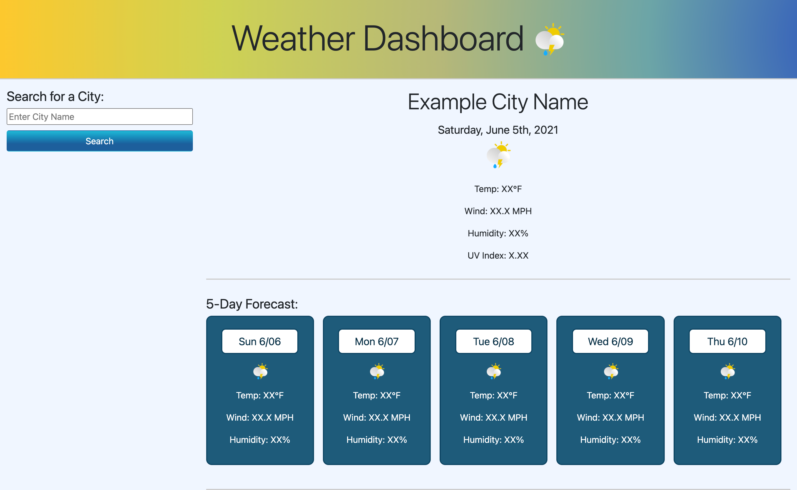

# Weather Dashboard

## Description
Weather Dashboard is a web application that allows users to look up the current weather and five-day forecast of a specified city. The goal of this assignment was to develop a better understanding of how to access data from third-party APIs and incorporate that data into an application. Using the OpenWeather One Call API, the final application is meant retrieve weather data of any city specified by the user using the search sidebar. 

## Links
[Here](https://go-yasi.github.io/weather-dashboard/) is a link to deployed application.

[Here](https://github.com/go-yasi/weather-dashboard) is a link to GitHub repository containing the application code.

## Usage
Below is a screenshot of the application: 

## Conclusion
Although I haven't made much progress in the development of this application, I am still happy with what I've managed to achieve so far! Last week, I was still struggling with the basics of JavaScript, but I definitely noticed that I'm a lot more comfortable now than I could have imagined. 

The most difficult part of this assignment was simply getting started. I was intimidated by the project but once I started working on it, I was very happy to learn that I'm more capable than I let myself believe.